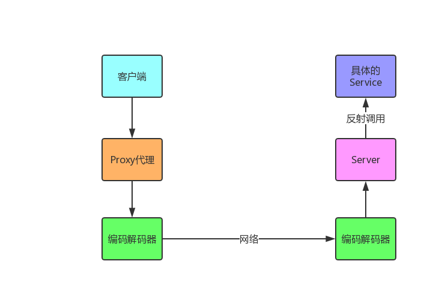

# 调用流程：


### 基本思路：
  客户端发起调用时，用代理类向service发送网络请求，服务端通过反射调用目标类的方法，调用完成后，服务端将结果通过网络传回客户端代理类，最终由代理类返回结果。
  
### 说明
在rpc-common的api包下有一个HelloService,具体实现类在rpc-server里面,并加上了@RpcInterface注解  
  
### 运行
1. 先运行rpc-server模块下面,com.yuanshijia.netty包里面的NettyServer
2. 运行rpc-test模块的Test类


### 结果
Test类如果调用成功，返回
```
15:52:00.808 [main] INFO com.yuanshijia.Test - 调用service成功 -> hello yuan
```


### 参考
https://juejin.im/post/5bac34b4e51d450e5d0b236b
  